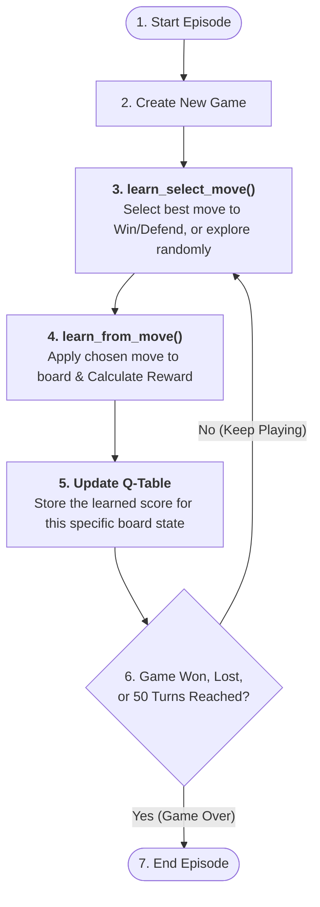

# Tsoro Yematatu Reinforcement Learning Project

This project implements the traditional African board game **Tsoro Yematatu** and trains a Tabular Q-Learning agent to master it. The game features a completely mathematically symmetric zero-sum reward function (Option C) and a hard 50-turn cap to enforce hyper-efficient, realistic gameplay. It also includes a Tkinter GUI for interactive human-vs-AI play.

---

## 📂 Project Structure   
```text
tsoro_yematatu/
│
├── game/
│   ├── game_interface.py             # Abstract interface for games
│   ├── tsoro_yematatu.py             # Tsoro Yematatu game rules & logic
│   ├── board_gui.py                  # Tkinter GUI for human play
│
├── agents/
│   ├── gui_agent.py                  # GUI wrapper for human vs computer
│   ├── qlearning_agent.py            # Core Q-learning agent with Option C reward
│
├── training/
│   ├── train_qlearning.py            # Train the Q-learning agent
│   ├── evaluate_master.py            # Tournament: 1000-episode agent vs historical checkpoints
│   ├── profile_training_intervals.py # Track average game lengths in 100-episode buckets
│
├── main.py                           # Entry point for GUI play
```

## 🚀 How to Use

### 1. Train the Agent
Train a fresh Q-learning agent. We recommend 1,000 to 5,000 episodes for optimal intelligence. This will generate a file called `qlearning_table.pkl` in the root directory.
```bash
python training/train_qlearning.py --episodes 5000
```

### 2. Play the Game (GUI)
Play interactively against the computer using the Tkinter GUI. By default, you play as 'X' (going first).
```bash
python main.py --mode qlearning --player O
```

**Options:**
- `--mode random` → computer plays completely random moves  
- `--mode qlearning` → computer uses trained Q‑learning agent  
- `--player X|O` → choose which side the computer plays (O goes second)
- `--model filename.pkl` → load a specific Q-table file (defaults to `qlearning_table.pkl`)

*Example:* To play as 'O' (meaning the AI goes first) against a specific 1000-episode model:
```bash
python main.py --mode qlearning --player X --model qlearning_table1000.pkl
```

### 3. Evaluate Checkpoints
Make a fully trained 1000-episode agent fight 200 games against every historical version of itself (Episodes 100, 200, 300, etc.) to see how win rates evolve.
*(Note: You must have generated models named `qlearning_table100.pkl` through `qlearning_table1000.pkl` before running this script).*
```bash
python training/evaluate_master.py
```

### 4. Profile Live Training Data
Track the live average length of games while the agent is actively learning (with `epsilon = 0.1` exploration enabled). This outputs average turn counts in buckets of 100 episodes.
```bash
python training/profile_training_intervals.py
```

---

## 🧠 Q-Learning Architecture (The Training Loop)

The Q-learning agent learns entirely through self-play. It dynamically switches between maximizing the score (Player 1) and minimizing the score (Player 2), using Temporal Difference (TD) to update its internal Q-Table.



## ✨ Key Features
- **Option C Symmetric Penalty:** Both players are penalized `-0.01` per turn, forcing the AI to win efficiently and defend fiercely.
- **50-Turn Cap:** Prevents endless stalling and mathematical collapse by forcing a draw at 50 turns.
- **Minimax Q-Learning:** A single state-value table correctly orchestrates optimal play for both 'X' and 'O'.
